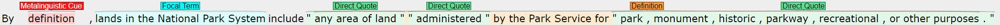

# CuRIAM

Corpus data and analysis for CuRIAM.



CuRIAM stands for Corpus re Interpretation and Metalanguage. For information about the corpus, see the paper:

 [_Corpus re Interpretation and Metalanguage in Supreme Court Opinions_](https://arxiv.org/abs/2305.14719) (arXiv, to appear at LREC-COLING 2024)


## Corpus Data
The full corpus data is available [here](/corpus/).

## Setup
1. Create a conda environment.
    ```
    $ conda env create -f environment.yml
    $ conda activate curiam
    ```

2. Install the `curiam` package locally.
    ```
    $ pip install --upgrade build
    $ pip install -e .
    ```

3. If you plan on running the gamma agreement calculations, install [pygamma-agreement](https://pypi.org/project/pygamma-agreement/) separately.

    ```
    $ sudo apt-get update
    $ sudo apt install coinor-libcbc-dev
    $ pip install "pygamma-agreement[cbc]"
    ```

    For Apple Silicon, Installing `cvxopt` via conda and then `pip install pygamma-agreement` without cbc may work, but I haven't tested it. If it does work, it may be slow.

## Acknowledgments
---
TODO

## License
---
TODO